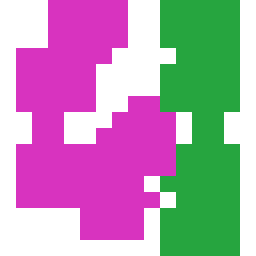

# Experiment 1: Seed Robustness

## 1. この実験の目的

本実験では、学習済みの Multi-head Network を固定したまま、Target 生成に用いる Seed だけを変えて Closed-loop 実行を行った。

目的は、単一のデモ実行で得られた結果が偶然ではないかを確認し、次の点を調べることである。

1. Policy が異なる Target に対して一貫して Stroke を生成できるか
2. Improvement Head が適切な時点で Stop を選択できるか
3. 実行後半に同一 Stroke の反復、すなわち Action Loop が発生するか
4. Seed によって最終誤差がどの程度変動するか
5. 次の Teacher vs Student 比較で検証すべき論点を明確にする

この実験はモデルの再学習ではない。したがって、Seed の違いは主として評価対象となる Target と、それに伴って Policy が訪れる Closed-loop 状態の違いを表す。

---

## 2. 実行条件

実行コマンドは次のとおりである。

```bash
for seed in 1 2 3 4 5 6 7 8 9 10
do
  python scripts/run_demo.py \
    --model artifacts/model.pt \
    --seed ${seed} \
    --output-dir artifacts/demo-seed-${seed}
done
```

各 Seed の成果物は次の構成で保存した。

```text
artifacts/
├── demo-seed-1/
│   ├── target.png
│   ├── final_canvas.png
│   ├── trajectory.gif
│   └── result.json
├── demo-seed-2/
│   └── ...
└── demo-seed-10/
    └── ...
```

評価時の最大 Step 数は 32 である。終了理由は次の二種類である。

- `policy_stop`: Improvement Head の予測値が Stop threshold を下回った
- `max_steps`: Stop が選択されないまま最大 Step 数に到達した

---

## 3. 評価指標

### 3.1 Final Error

最終 Canvas と Target の誤差。小さいほど Target に近い。

### 3.2 Steps

終了までに実行された Stroke 数。`policy_stop` の場合は Policy 自身が終了時点を選び、`max_steps` の場合は外部上限によって終了した。

### 3.3 Longest Repeated Action

同一 Stroke index が連続して選択された最大回数。

本書では、これを Action Loop の簡易指標として用いる。

### 3.4 Zero-improvement Steps

`actual_improvement = 0` となった Step 数。同じ Stroke を既に同じ Canvas に適用しても状態が変わらない場合、この値が連続して現れる。

### 3.5 Trajectory MAE

各 Stroke における `predicted_improvement` と `actual_improvement` の絶対誤差平均。

---

## 4. 結果一覧

| Seed | Final Error | Steps | Stop Reason | 最大連続反復 | Actual=0 | Actual<0 | Trajectory MAE |
|---:|---:|---:|---|---:|---:|---:|---:|
| 1 | 0.0899 | 32 | max_steps | 909 × 19 | 19 | 0 | 0.0052 |
| 2 | 0.0205 | 32 | max_steps | 628 × 5 | 5 | 1 | 0.0024 |
| 3 | 0.0566 | 32 | max_steps | 4 × 6 | 6 | 0 | 0.0019 |
| 4 | 0.0747 | 32 | max_steps | 815 × 17 | 17 | 1 | 0.0035 |
| 5 | 0.1019 | 32 | max_steps | 269 × 15 | 15 | 0 | 0.0055 |
| 6 | 0.0653 | 28 | policy_stop | なし | 0 | 1 | 0.0020 |
| 7 | 0.0515 | 16 | policy_stop | なし | 0 | 0 | 0.0014 |
| 8 | 0.0873 | 32 | max_steps | 541 × 14 | 14 | 2 | 0.0047 |
| 9 | 0.0447 | 32 | max_steps | 62 × 17 | 17 | 1 | 0.0024 |
| 10 | 0.1320 | 32 | max_steps | 46 × 23 | 23 | 0 | 0.0076 |

---

## 5. 集計結果

- Final Error 平均: **0.0724**
- Final Error 標準偏差: **0.0319**
- Final Error 最小: **0.0205**（Seed 2）
- Final Error 最大: **0.1320**（Seed 10）
- `policy_stop`: **2 / 10**
- `max_steps`: **8 / 10**
- 2回以上の同一 Action 反復: **8 / 10**
- 10回以上の強い Action Loop: **6 / 10**

Final Error は 0.0205 から 0.1320 まで広がり、最良と最悪の間には約 **6.4 倍**の差があった。

ただし、この差を直ちに「Seed に対する不安定性」と解釈してはならない。Seed ごとに Target 自体が異なるため、Target の難易度差も含まれているからである。Experiment 1 が示すのは、現行 Policy が異なる Target に対して異なる失敗様式を見せるという事実である。

---

## 6. 主要な観察

### 6.1 Regression Collapse は再発していない

以前の失敗では、Improvement Head の出力がほぼゼロに Collapse し、Policy が Step 0 で停止した。

今回の10実行では、すべての Seed で複数の Stroke が選択された。Seed 7 でも 16 Stroke、Seed 6 では 28 Stroke が実行されている。

したがって、少なくとも今回のモデルでは次が確認できる。

- Shared Encoder から Stroke Head と Improvement Head の双方へ有効な特徴が供給されている
- Improvement Head は正の改善量を表現できる
- Threshold-based Stop は完全に壊れてはいない
- Standardization と SmoothL1Loss を導入した後の回帰 Collapse は再現していない

これは「問題が解決した」というより、より後段の Closed-loop 問題を観察できる段階へ進んだことを意味する。

---

### 6.2 Stop は可能だが、再現性は低い

Policy 自身が停止したのは Seed 6 と Seed 7 の2例だけであった。

#### Seed 6

- Final Error: 0.0653
- Steps: 28
- 最終予測改善量: -0.000181
- 同一 Action の連続反復なし

#### Seed 7

- Final Error: 0.0515
- Steps: 16
- 最終予測改善量: -0.000218
- 同一 Action の連続反復なし

この2例では、実行後半まで Stroke が変化し続け、最後に Improvement Head が負の値を返して停止している。

したがって、現行の Stop 設計は概念的には成立している。しかし、10 Seed 中2 Seed に限られるため、現時点で安定した終了戦略とは評価できない。


---

### 6.3 多くの Seed で Action Loop が発生した

10 Seed 中8 Seed で同一 Stroke の連続反復が確認された。特に次の Seed では10回以上の強い Loop が発生した。

| Seed | Stroke Index | 連続回数 | 反復中の Actual Improvement |
|---:|---:|---:|---:|
| 1 | 909 | 19 | 0 |
| 4 | 815 | 17 | 0 |
| 5 | 269 | 15 | 0 |
| 8 | 541 | 14 | 0 |
| 9 | 62 | 17 | 0 |
| 10 | 46 | 23 | 0 |

典型的な状態遷移は次のとおりである。

```text
同じ Stroke を選ぶ
        ↓
Canvas が変化しない
        ↓
次の Observation も変化しない
        ↓
Network の出力も変化しない
        ↓
同じ Stroke を再び選ぶ
```

これは決定論的 Policy における固定点である。

環境が同一 Action の再適用を冪等に扱う場合、Canvas は変化しない。その結果、Observation が完全に同じなら、Policy は同じ Action と同じ predicted improvement を返し続ける。

つまり今回の Loop は、単なる偶発的な連続選択ではない。状態と Action の組が自己維持する Closed-loop の吸収状態である。

---

### 6.4 Improvement Head は「行動の効果」ではなく「状態の改善可能性」を予測している可能性がある

Seed 10 では Stroke 46 が23回連続して選択された。

反復中の値は次のとおりである。

```text
predicted_improvement = 0.009817...
actual_improvement    = 0.0
```

Canvas が変わらないため、同じ予測値がそのまま反復される。

この現象は、Improvement Head が現在選択された Stroke の条件付き効果を十分に表現できていない可能性を示す。

概念的には、必要なのは次の量である。

```text
Improvement(current_state, selected_action)
```

一方、現行構造が Shared Feature から直接一つの改善量を出力している場合、実質的には次に近い量を学習している可能性がある。

```text
Improvement(current_state)
```

あるいは、

```text
Teacher が選びそうな Action を適用した場合の期待改善量
```

この二つは、Stroke Head が誤った Action を選択したときに分離する。

Stroke Head が既に描画済みの Stroke を選んでも、Improvement Head はその Action に明示的に条件付けられていなければ、「この状態にはまだ改善余地がある」と正しく予測しながら、「今選んだ Stroke は改善しない」という事実を表現できない。

この点は、単なる Observation Design の問題とは限らない。Head 間の結合方法そのものに関係する可能性がある。

---

### 6.5 実行前半は比較的妥当で、後半に失敗が集中する

各 Seed の初期 Stroke では、predicted improvement と actual improvement が近い例が多い。

一方、実行後半では次が現れる。

- 改善量の過大評価
- 負の Actual Improvement
- 同一 Action の反復
- `actual_improvement = 0` の連続
- Stop threshold を下回らないまま `max_steps`

これは Behavior Cloning の典型的な問題設定と整合する。

Teacher trajectory 上で学習した Policy が、一度 Teacher から外れた状態を訪れると、その状態に対する正解 Action を十分に学習していない。その誤差が次の状態をさらに Training Distribution から遠ざける。

ただし、本実験だけでは Distribution Shift が唯一の原因とは断定できない。Action-conditioned Improvement の欠如や、同一 Action の再選択を抑止する仕組みがないことも Loop を増幅している。

---

## 7. 代表例

### 7.1 最良 Final Error: Seed 2

Seed 2 は Final Error 0.0205 で10例中最良だった。

しかし終了理由は `max_steps` であり、最後の5 Step は Stroke 628 の反復だった。

この結果は重要である。画像近似が良好でも、終了戦略が良好とは限らない。

すなわち、次の二つは別の評価軸として扱う必要がある。

1. Canvas quality
2. Termination quality


---

### 7.2 正常な Policy Stop: Seed 7

Seed 7 は16 Step で停止し、Final Error は0.0515だった。

最終 Stroke の actual improvement は約0.00052で、その次の状態に対して Improvement Head が負の値を返している。少なくとも Threshold の動作としては自然である。

Target は滑らかな色勾配である一方、Final Canvas は離散的な Stroke の集合として表現されている。この差は Policy だけでなく、現在の Action Space が持つ表現限界を示している可能性がある。


---

### 7.3 最長 Action Loop: Seed 10

Seed 10 は次の特徴を持つ。

- Final Error: 0.1320
- Steps: 32
- Stop Reason: `max_steps`
- Stroke 46 の連続反復: 23回
- 反復中の predicted improvement: 約0.00982
- 反復中の actual improvement: 0

Target は連続的な色勾配だが、Final Canvas は大きな離散領域に分割され、白い未描画領域も残っている。

それにもかかわらず、Policy は別の未描画領域へ移動せず、既に効果を失った Stroke 46 に固定された。

これは「改善余地を認識できない」というより、「改善余地に対応する Action を選べない」現象として読む方が自然である。





---

## 8. 仮説の更新

Experiment 1 の結果を受け、既存仮説を次のように更新する。

### H1: Multi-head learning は安定している

**暫定的に支持。**

10 Seed すべてで Stroke が生成され、Step 0 Stop は再発しなかった。Improvement Head の Collapse は少なくとも今回の評価では見られない。

### H2: Standardization と SmoothL1Loss は Improvement Collapse を抑制する

**暫定的に支持。**

ただし、Raw / Standardized / Log の比較は Experiment 4 で直接検証する。

### H3: 後半の予測誤差は Distribution Shift によって増える

**部分的に支持。**

後半で過大評価や Action Loop が増える。ただし、Action Loop に入った後は同一 Observation が繰り返されるため、「Step が後半だから誤差が増える」のではなく、「特定の OOD 状態に入ると固定される」と表現する方が正確である。

### H4: DAgger は後半状態の Action 選択を改善する

**未検証だが妥当性が増した。**

Student が実際に訪れる Loop 直前の状態で Teacher label を収集できれば、既に効果を失った Stroke から別の Stroke へ移る学習信号を追加できる。

### H5: 画像品質は Action Space の制約を受ける

**支持する観察あり。**

特に連続勾配 Target と離散 Stroke Canvas の差は大きい。ただし Teacher も同じ Action Space を使うため、Experiment 2 で Teacher の到達誤差を測定する必要がある。

### H6: Stop threshold は Dataset accuracy だけでは選べない

**支持。**

最良 Final Error の Seed 2 が停止できず、より誤差の大きい Seed 6 と7が停止した。Stop の良否は単純な最終誤差だけでなく、残存する正の改善可能性と不要 Stroke の回避によって評価すべきである。

---

## 9. 新しい仮説

### H8: Improvement Head は Action-conditioned である必要がある

現行 Improvement Head が状態特徴だけから一つの値を出している場合、Stroke Head が選んだ具体的 Action の実効改善量を直接評価できない。

今後は、例えば次の構造を比較対象にできる。

```text
Shared Encoder
    ├── Stroke logits
    └── Q-like improvement values for every stroke
```

または、

```text
Shared Encoder
    ↓
selected stroke embedding
    ↓
Improvement(state, selected stroke)
```

これは Improvement Head を Critic に近づける変更である。ただし、DAgger 前に構造を大きく変えると原因切り分けが難しくなるため、現時点では仮説として記録する。

### H9: Repeated Action は独立した評価指標として必要である

Final Error だけでは、Seed 2 のように画像品質は良いが終了できないケースを見落とす。

今後は少なくとも次を記録する。

- longest repeated action run
- zero-improvement step count
- first zero-improvement step
- wasted steps after last positive improvement
- stop regret

### H10: Stop は単一 Step の予測値だけでなく履歴を用いる方が安定する

単一予測値による Stop はノイズに弱い。

将来的には次のような条件を比較できる。

```text
predicted_improvement < threshold
```

に加えて、

```text
直近 k Step の predicted improvement 平均 < threshold
```

または、

```text
同一 Action が n 回続き、actual state change がない
```

ただし後者は Policy の知能ではなく安全装置であるため、学習上の問題を隠さないよう区別して扱う。

---

## 10. Experiment 1 の結論

本実験では、Multi-head Network が異なる10個の Seed に対して Stroke を生成できることを確認した。Improvement Head の Regression Collapse は再発せず、2 Seed では Policy 自身による Stop も成立した。

一方で、8 Seed が `max_steps` に到達し、多くの実行で同一 Stroke の反復が発生した。強い Loop に入った後は Canvas が変化せず、actual improvement が0であるにもかかわらず、predicted improvement は正の値を維持した。

したがって現段階の中心課題は、単純な回帰精度ではなく次の Closed-loop 問題である。

1. Student が訪れる状態での Stroke 選択
2. 選択 Stroke に条件付けられた改善量推定
3. 無効になった Action から脱出する仕組み
4. Canvas quality と Termination quality の分離評価

この結果は DAgger 導入の動機を強める。ただし、その前に Teacher が同じ Target に対してどこまで到達できるかを測定し、Policy の限界と Action Space の限界を切り分ける必要がある。

---

## 11. Experiment 2 への接続

次の実験は Teacher vs Student 比較とする。

同一 Seed、同一 Target、同一最大 Step 数の下で、少なくとも次を比較する。

| 指標 | Teacher | Student |
|---|---:|---:|
| Final Error |  |  |
| Steps |  |  |
| Stop Reason |  |  |
| 累積 Actual Improvement |  |  |
| Negative-improvement Steps |  |  |
| Zero-improvement Steps |  |  |
| Longest Repeated Action |  |  |

この比較により、次を切り分ける。

### Teacher が Student より大幅に良い場合

Policy 学習または Closed-loop Distribution Shift が主因である。DAgger の導入価値が高い。

### Teacher と Student が同程度の場合

Action Space、Canvas renderer、Target 表現など環境側の制約が主因である可能性が高い。

### Teacher も Stop できない場合

Stop 定義、改善量、threshold、最大 Step 数など Termination Design を再検討する必要がある。

---

## 12. 再現用成果物

各 Seed の成果物は次に保存されている。

```text
artifacts/demo-seed-{seed}/
```

各ディレクトリには次を含む。

- `target.png`
- `final_canvas.png`
- `trajectory.gif`
- `result.json`

数値集計用の表は、別途 `experiment-1-seed-summary.csv` として保存する。
